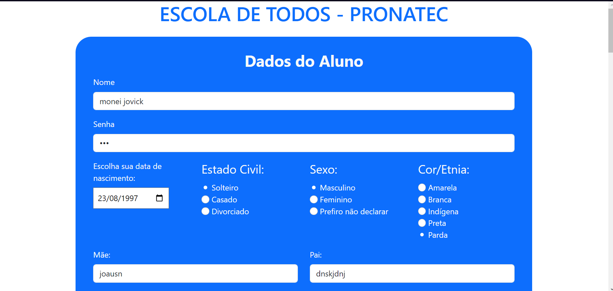
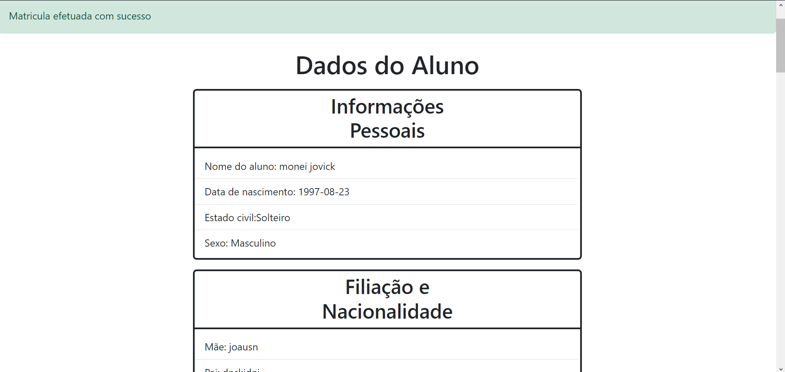
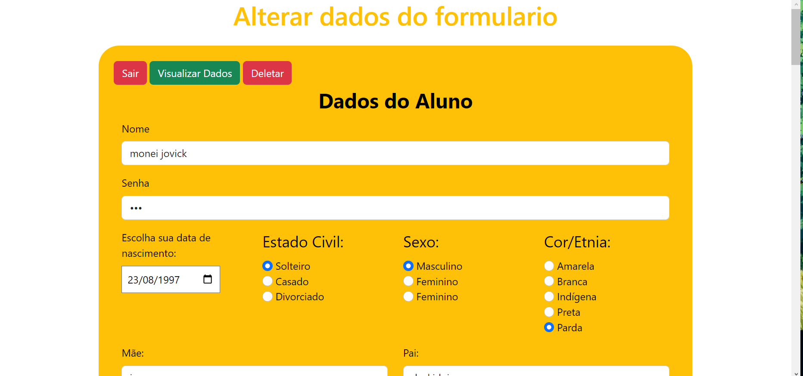

# Formulario de inscrição Pronatec

A fim de modernizar o preenchimento do Formulario de inscrição do Pronatec foi feito essa versão online durante o curso tecnico de informática, na disciplina de programação web.


## Screenshots






## Aprendizados

✔️ Conexao com o banco de dados e realização de crud com php, executando as funções, de criar , ler , alterar e deletar dados.

✔️ Adaptação de um formulario que antes era preenchido em papel, para um meio digital, aprendendo assim uma forma de modernizar processos.

✔️ Criação de um sistema de login , com usuario e senha para o candidato realizar eventuais consultas alterar dados ou deletar sua inscrição.


## Rodando localmente

Clone o projeto

```bash
  git clone https://github.com/GustavoDiasC/formulario-pronatec-php
```

Use um servidor php ou xampp e faça uma copia para rodar localmente

```bash
  htdocs > pasta do projeto > index > abrir com navegador
```


Mude o endereço 

```bash
  retire o caminho da pasta ate /htdocs e coloque localhost no lugar
```

Execute o banco de dados
```bash
  pegue o arquivo mydb.sql e suba uma copia local do banco na maquina.
```
## 🔗 Links
[](https://github.com/GustavoDiasC/)
[](https://www.linkedin.com/in/gustavo-dias-497a3b227/)


## 🚀 Sobre mim
<div style="display:flex; align-items:center; justify-content:center;"><a href="https://github.com/GustavoDiasC"><br /><sub style="display:flex; align-items:center; justify-content:center;" ><b>Gustavo dias</b></sub></a></div>


